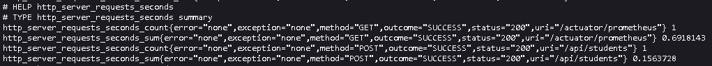
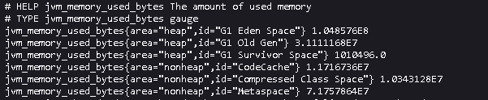
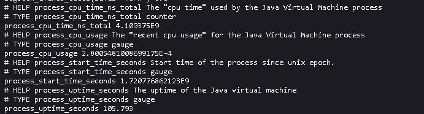

# Basic APM Spring Boot App

- To achieve comprehensive monitoring and logging of metrics such as CPU usage, database connections, and response
  times in a Spring Boot application with Prometheus integration, follow these steps:

## Summary

You can set up comprehensive monitoring for your Spring Boot application, collecting and visualizing metrics such as
response times, CPU usage, and database connections. Here's a summary of the key components:

- Spring Boot Actuator: Provides endpoints for exposing metrics.
- Micrometer: Records and manages metrics in a vendor-neutral way.
- Prometheus: Scrapes and stores metrics data.
- Grafana: Visualizes metrics data for monitoring and analysis.

This setup allows you to gain valuable insights into the performance and health of your Spring Boot application and take
proactive measures to ensure its smooth operation.

### Note: Grafana has not been integrated in this application

- Set up Grafana to visualize the metrics collected by Prometheus.
- Add Prometheus as a Data Source:
    - Open Grafana and navigate to Configuration > Data Sources.
    - Add a new data source and select Prometheus.
    - Configure the URL to point to your Prometheus server (e.g., http://localhost:9090).

- Create Dashboards:
    - Create dashboards in Grafana using the data from Prometheus.
    - Use the metrics exposed by Spring Boot Actuator, such as http_server_requests_seconds_count,
      jvm_memory_used_bytes, process_cpu_usage, hikaricp_connections, etc.

Example Grafana Panels:

#### HTTP Requests Response Time:

- Metric: http_server_requests_seconds

#### CPU Usage:

- Metric: process_cpu_usage

#### Database Connections:

- Metric: hikaricp_connections_active

